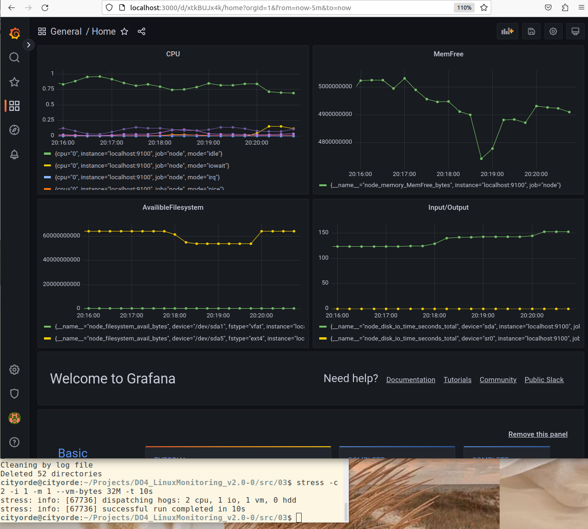

## Prometheus и Grafana

#### Установить и настроить Prometheus и Grafana на виртуальную машину

Устанавливаем Prometheus как в инстуркции оффициального сайта (https://prometheus.io/docs/prometheus/latest/getting_started/)

Проверяем статус

Скачиваем Node-Exporter для работы с метриками по инструкции офф сайта (https://prometheus.io/docs/guides/node-exporter/)

Устанавливаем Grafana по инструкции с офф сайта (grafana.com/grafana/download)

Проверяем статус

#### Получить доступ к веб интерфейсам Prometheus и Grafana с локальной машины

Открываем в браузере страницу localhost:9090

Открываем в браузере страницу localhost:3000 (log: admin pass:admin)

#### Добавить на дашборд Grafana отображение ЦПУ, доступной оперативной памяти, свободное место и кол-во операций ввода/вывода на жестком диске

#### Запустить ваш bash-скрипт из Части 2

Посмотреть на нагрузку жесткого диска (место на диске и операции чтения/записи)

#### Установить утилиту stress и запустить команду stress -c 2 -i 1 -m 1 --vm-bytes 32M -t 10s

Посмотреть на нагрузку жесткого диска, оперативной памяти и ЦПУ

