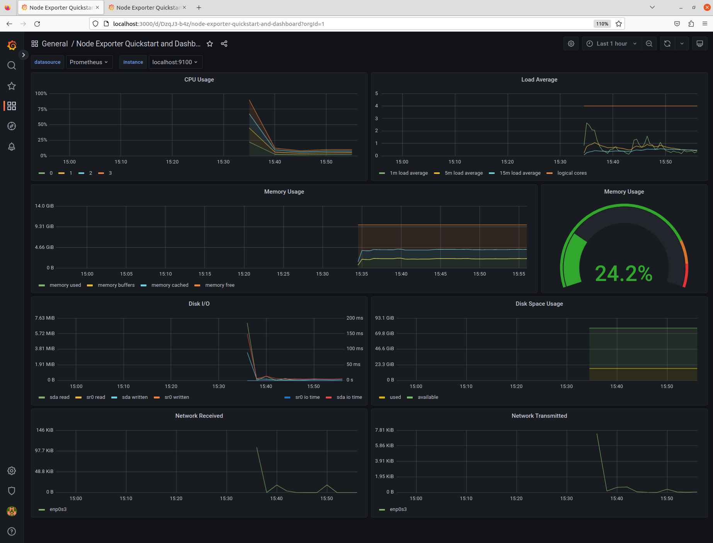
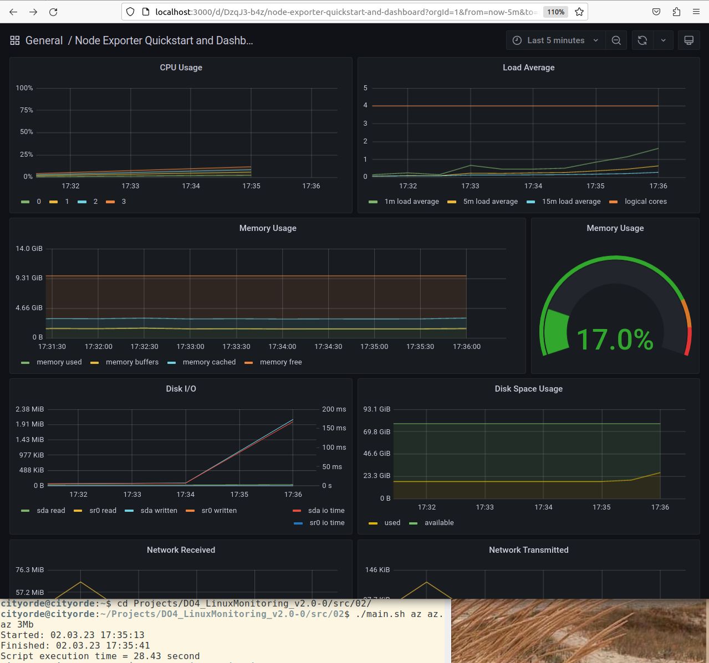
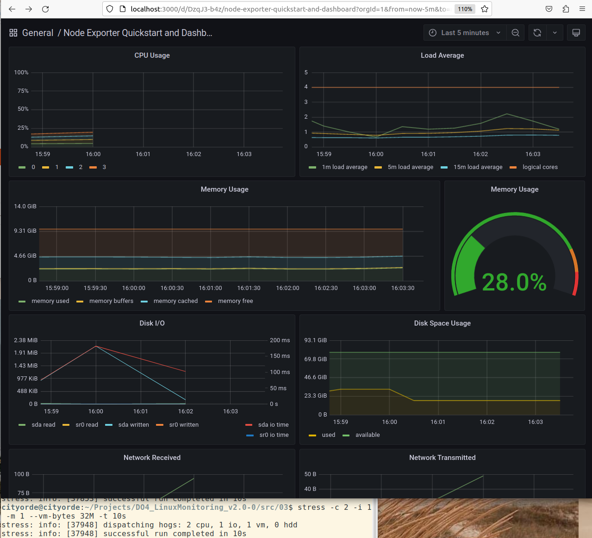
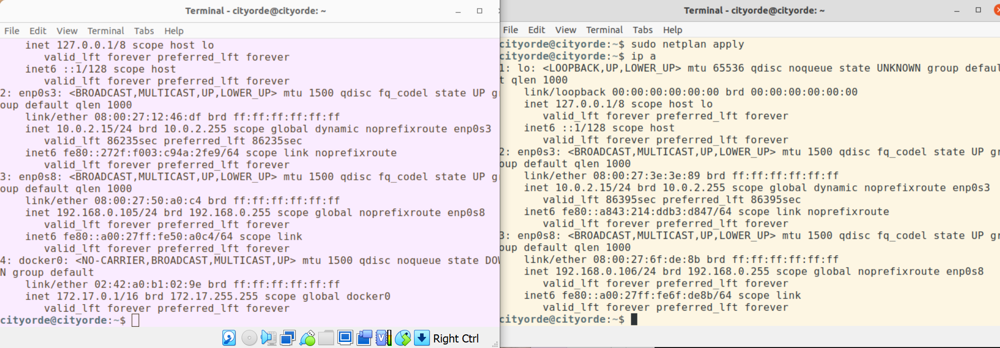
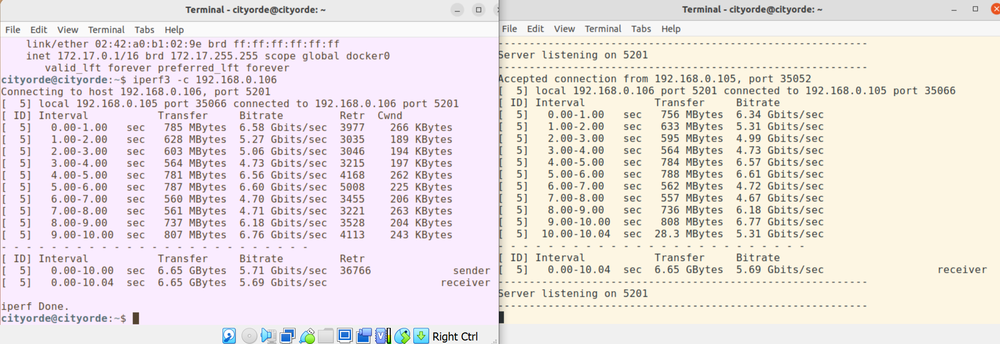
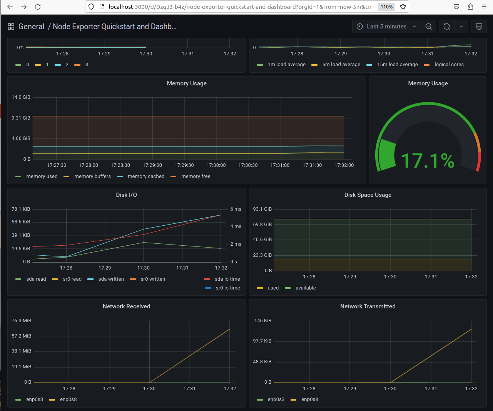

## Готовый дашборд

#### Установить готовый дашборд Node Exporter Quickstart and Dashboard с официального сайта Grafana Labs

#### Провести те же тесты, что и в Части 7

Запустить ваш bash-скрипт из Части 2
Посмотреть на нагрузку жесткого диска

Запустить команду stress -c 2 -i 1 -m 1 --vm-bytes 32M -t 10s
Посмотреть на нагрузку жесткого диска, оперативной памяти и ЦПУ

#### Запустить ещё одну виртуальную машину, находящуюся в одной сети с текущей

#### Запустить тест нагрузки сети с помощью утилиты iperf3

#### Посмотреть на нагрузку сетевого интерфейса

