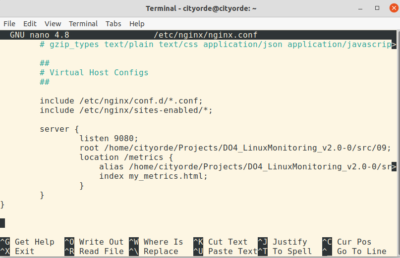
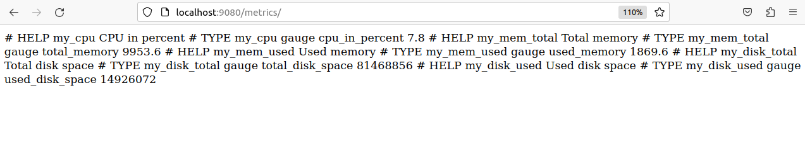
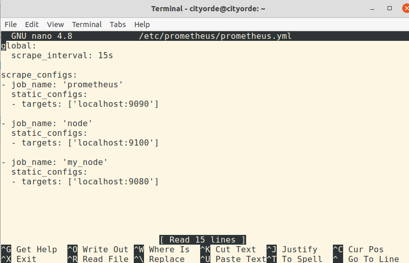
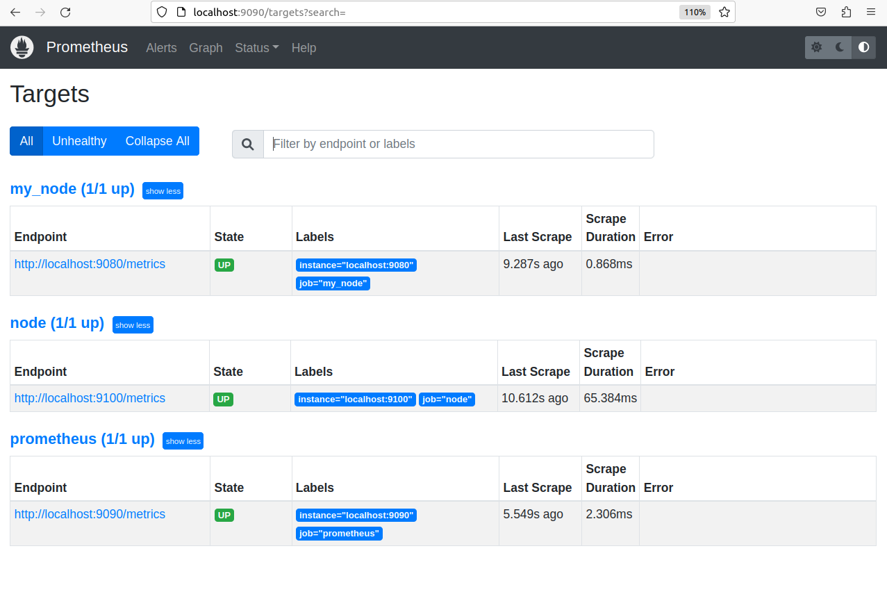
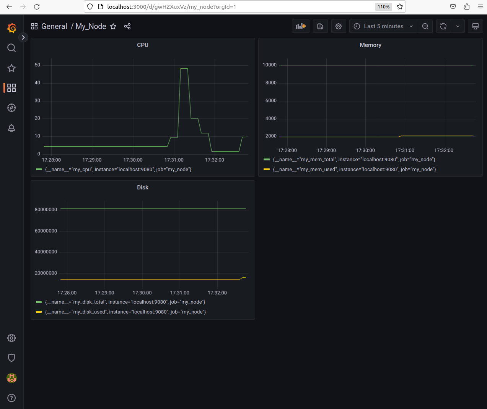
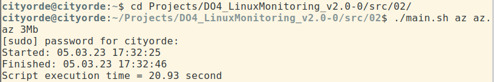
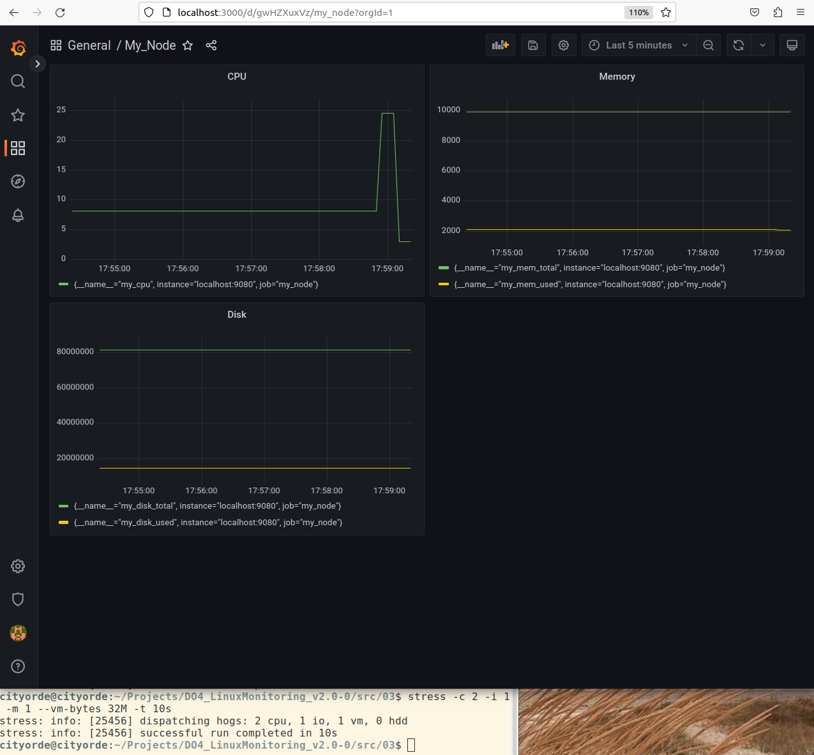

## Дополнительно. Свой node_exporter

Написать bash-скрипт или программу на Си, которая собирает информацию по базовым метрикам системы (ЦПУ, оперативная память, жесткий диск (объем)).

#### Скрипт или программа должна формировать html страничку по формату Prometheus, которую будет отдавать nginx.

Саму страничку обновлять можно как внутри bash-скрипта или программы (в цикле), так и при помощи утилиты cron, но не чаще, чем раз в 3 секунды.

#### Поменять конфигурационный файл Prometheus, чтобы он собирал информацию с созданной вами странички.

#### Провести те же тесты, что и в Части 7

Запустить ваш bash-скрипт из Части 2

Посмотреть на нагрузку жесткого диска

Запустить команду stress -c 2 -i 1 -m 1 --vm-bytes 32M -t 10s

Посмотреть на нагрузку жесткого диска, оперативной памяти и ЦПУ

